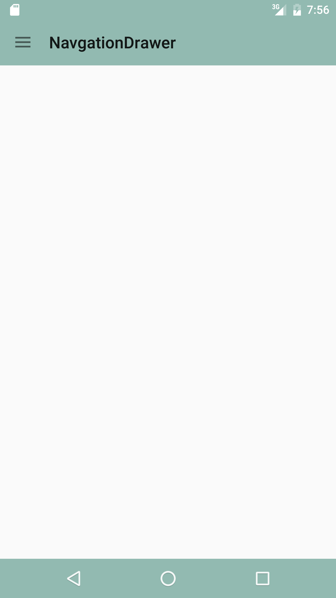
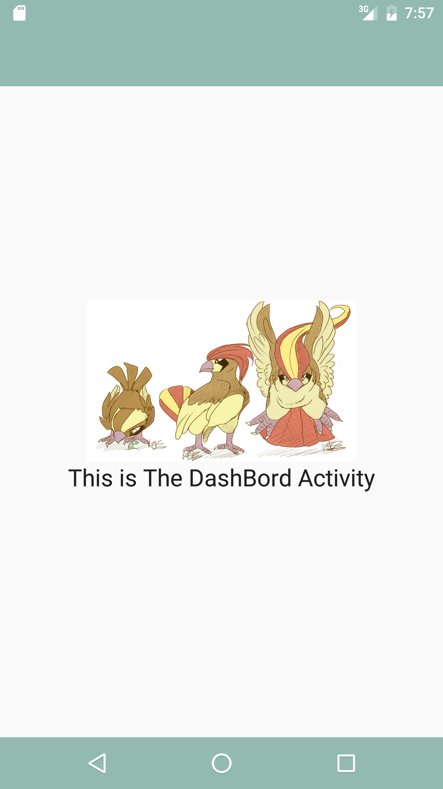
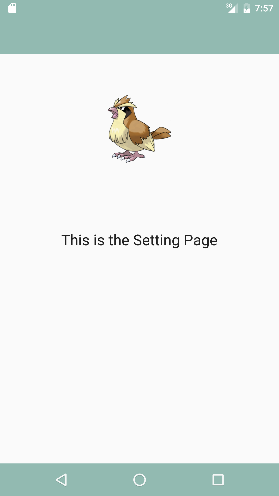

# 1.1 NavigationDrawerTemplate
	This is a basic Template for Android Mapping between Activities and Navigation Drawer
## Installation
	Simply Download the repo and sync your gradle
## Usage
	This is a template that you can build an application around "when it Complete  75% are done", 
	it dosent map to FRAGMENTS. i wanted to route to activities for this template. 

## ScreenShots

## Notes
	Still Working on the toolbar to make it apear at every activity.
#Star it, if it helps you 
